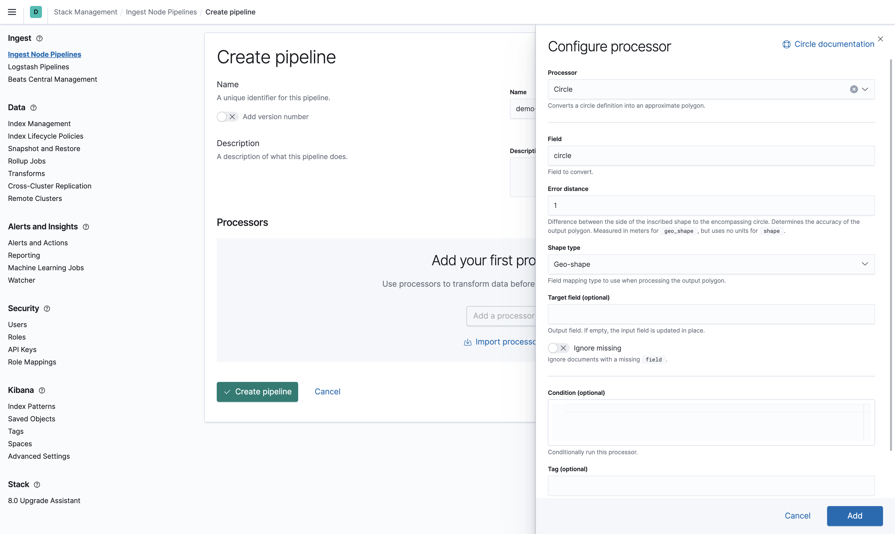

# Demo scripts used for Elastic Daily Bytes - Ingest Processors


## Setup

The setup will check that Elasticsearch and Kibana are running and will remove index named `kibana_sample_data_ecommerce`, `demo-ingest*`, the index templates `demo-ingest` and any ingest pipeline named `demo-ingest-*`.

It will also add Kibana Canvas slides.

### Run on cloud (recommended)

This specific configuration is used to run the demo on a [cloud instance](https://cloud.elastic.co).
You need to create a `.cloud` local file which contains:

```
CLOUD_ID=the_cloud_id_you_can_read_from_cloud_console
CLOUD_PASSWORD=the_generated_elastic_password
```

Run:

```sh
./setup.sh
```

### Run Locally

Run Elastic Stack:

```sh
docker-compose down -v
docker-compose up
```

And run:

```sh
./setup.sh
```

## Ingest Pipeline

This picture describes how an ingest pipeline is working.


## Demo part

### Circle Ingest Processor

Adapted from the [7.4.0 release notes](https://www.elastic.co/blog/elasticsearch-7-4-0-released):

> Before this processor, when ingesting and indexing a circle into Elasticsearch, users had two options:
> 
> * Ingest and index the circle using a prefix tree - this option is simple to do, but results in a slower and larger index (since this method does not enjoy the benefits of the BKD-Tree) - this was the “easy way”
> * Provide Elasticsearch with a polygon that closely resembles the circle before ingestion and index that polygon - this option provides a smaller and better performing index (since it does use the BKD-Tree) - but the user was responsible for translating the circle into a polygon in an efficient and accurate way, which is not trivial - this was the “efficient way”
> 
> The circle ingest processor translates circles into polygons that closely resemble them as part of the ingest process, which means ingesting, indexing, searching, and aggregating circles, just became both easy and efficient.

This processor is doing some approximation behind the scene.


Open Stack Management / Ingest Node Pipelines and create a new pipeline `demo-ingest-circle`.
Add a `Circle` processor on `circle` field with a `Geo-shape` Shape type.



Add 2 documents to test the processor:

```json
[
  {
    "_source": {
      "circle": "CIRCLE (30 10 40)"
    }
  },
  {
    "_source": {
      "circle": {
        "type": "circle",
        "radius": "40m",
        "coordinates": [
          30,
          10
        ]
      }
    }
  }
]
```

Adjust the Error distance to `100` and show the effect when running again the test.

You can now "Save the pipeline".


### Enrich Ingest Processor

You can use the enrich processor to add data from your existing indices to incoming documents during ingest.


We have an existing `person` dataset.

```
GET /demo-ingest-person/_search?size=1
```

It contains the name, the date of birth, the country and the geo location point.

```json
{
  "name" : "Gabin William",
  "dateofbirth" : "1969-12-16",
  "country" : "France",
  "geo_location" : "POINT (-1.6160727494218965 47.184827144381984)"
}
```

We also have a `regions` dataset.

```
GET /demo-ingest-regions/_search?size=1
```

It contains all the french regions (or departments) with the region number, name and the polygons which represents the shape of the region.

```json
{
  "region" : "75",
  "name" : "Paris",
  "location" : {
    "type" : "MultiPolygon",
    "coordinates" : [
      [
        [
          [ 2.318133, 48.90077 ],
          [ 2.283084, 48.886802],
          [ 2.277243, 48.87749],
          // ...
          [ 2.318133, 48.90077]
        ]
      ]
    ]
  }
}
```

We can define an enrich policy. It reads from `demo-ingest-regions` index and tries to geo match on the `location` field.

```
PUT /_enrich/policy/demo-ingest-regions-policy
{
  "geo_match": {
    "indices": "demo-ingest-regions",
    "match_field": "location",
    "enrich_fields": [ "region" ]
  }
}

# We need to execute this policy
POST /_enrich/policy/demo-ingest-regions-policy/_execute
```

We can now define an ingest pipeline (using the REST API here). It will:

* Enrich the dataset by using our `demo-ingest-regions-policy` Policy
* Rename the region number and region name fields to `region` and `region_name`
* Remove the non needed fields (`geo_data`)

```
PUT /_ingest/pipeline/demo-ingest-enrich
{
  "description": "Enrich French Regions",
  "processors": [
    {
      "enrich": {
        "policy_name": "demo-ingest-regions-policy",
        "field": "geo_location",
        "target_field": "geo_data",
        "shape_relation": "INTERSECTS"
      }
    },
    {
      "rename": {
        "field": "geo_data.region",
        "target_field": "region"
      }
    },
    {
      "rename": {
        "field": "geo_data.name",
        "target_field": "region_name"
      }
    },
    {
      "remove": {
        "field": "geo_data"
      }
    }
  ]
}
```

We can simulate this (optionally with `?verbose`).

```
POST /_ingest/pipeline/demo-ingest-enrich/_simulate
{
  "docs": [
    {
        "_index" : "demo-ingest-person",
        "_type" : "_doc",
        "_id" : "KvRXRngBphqu6E4nbA6w",
        "_score" : 1.0,
        "_source" : {
          "name" : "Gabin William",
          "dateofbirth" : "1969-12-16",
          "country" : "France",
          "geo_location" : "POINT (-1.6160727494218965 47.184827144381984)"
        }
      }
  ]
}
```

It gives:

```json
{
  "docs" : [
    {
      "doc" : {
        "_index" : "demo-ingest-person",
        "_type" : "_doc",
        "_id" : "KvRXRngBphqu6E4nbA6w",
        "_source" : {
          "dateofbirth" : "1969-12-16",
          "country" : "France",
          "geo_location" : "POINT (-1.6160727494218965 47.184827144381984)",
          "name" : "Gabin William",
          "region_name" : "Loire-Atlantique",
          "region" : "44"
        },
        "_ingest" : {
          "timestamp" : "2021-03-18T18:03:45.129462595Z"
        }
      }
    }
  ]
}
```

So we can reindex our existing dataset to enrich it with our pipeline.

```
POST /_reindex
{
  "source": {
    "index": "demo-ingest-person"
  },
  "dest": {
    "index": "demo-ingest-person-new",
    "pipeline": "demo-ingest-enrich"
  }
}
```

And finally compare the source index and the destination index.

```
GET /demo-ingest-person/_search?size=1
```

It shows.

```json
{
  "name" : "Gabin William",
  "dateofbirth" : "1969-12-16",
  "country" : "France",
  "geo_location" : "POINT (-1.6160727494218965 47.184827144381984)"
}
```

And for the destination index, we can also ask the repartition per region.

```
GET /demo-ingest-person-new/_search?size=1
{
  "aggs": {
    "regions": {
      "terms": {
        "field": "region_name"
      }
    }
  }
}
```

We can see how the `_source` has been enriched.

```json
{
  "dateofbirth" : "1969-12-16",
  "country" : "France",
  "geo_location" : "POINT (-1.6160727494218965 47.184827144381984)",
  "name" : "Gabin William",
  "region_name" : "Loire-Atlantique",
  "region" : "44"
}
```

And the distribution of our dataset.

```
{
  "regions" : {
    "buckets" : [
      {
        "key" : "Loire-Atlantique",
        "doc_count" : 115
      },
      {
        "key" : "Val-d’Oise",
        "doc_count" : 67
      },
      {
        "key" : "Paris",
        "doc_count" : 47
      },
      {
        "key" : "Hauts-de-Seine",
        "doc_count" : 8
      },
      {
        "key" : "Val-de-Marne",
        "doc_count" : 3
      }
    ]
  }
}
```


